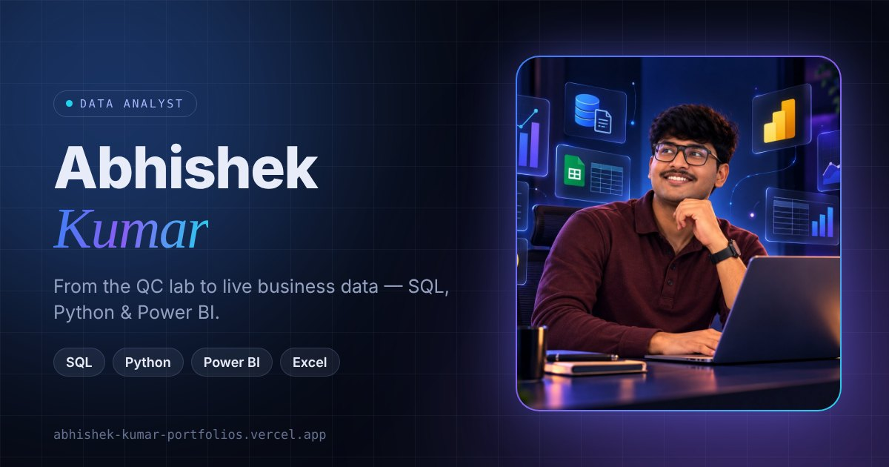

# Abhishek Kumar — Data Analyst Portfolio

**Live site → [abhishek-kumar-portfolios.vercel.app](https://abhishek-kumar-portfolios.vercel.app)**



Personal portfolio showcasing my work as a Data Analyst — from live inventory and order-tracking systems I run at a gearbox manufacturer, to SQL investigations, Power BI dashboards and an AI-powered SQL agent.

---

## Featured work

| Project | What it shows | Stack |
|---|---|---|
| **Inventory Management System** | 1,800+ SKUs, 6,100+ logged transactions, reorder logic, reconciliation & audit checks — running in daily operations | Google Apps Script, Google Sheets |
| **AI SQL Analytics Agent** | Natural-language → SQL agent that detects errors and dirty data and corrects its own queries | Python, PostgreSQL, LLM tool-calling |
| **FDA Adverse Events Analysis** | 90,786-record public-health investigation in SQL | MySQL, Excel |
| **Strait of Hormuz Oil Dashboard** | 40 years of oil prices vs geopolitical events, 211 countries | Power BI, DAX |
| **Flow Management System** | 24-step order-to-dispatch tracking with batch-level turnaround-time analysis | Google Apps Script, Looker Studio |
| **Netflix · Healthcare · Railway · Delegation** | SQL analysis, executive dashboards, data modelling, a full-stack Apps Script app | SQL, Power BI, Apps Script |

Each project opens into a case study covering the business problem, architecture, workflow, data processing, insights and links to the code.

## Highlights

- **Real data, clearly labelled** — analytics charts are built from my own project data; company systems are shown without confidential information.
- **Interactive case studies** — deep-linkable (e.g. `/#project/fms`), with diagrams that animate as you scroll and an explorer showing how the same workflow engine maps to different business processes.
- **Motion with restraint** — smooth scrolling, pinned horizontal project gallery and micro-interactions on desktop; a lighter, swipe-based layout on phones; all animation disabled for users who prefer reduced motion.
- **Fast & accessible** — static build, lazy-loaded charts, semantic HTML, keyboard navigation, light/dark themes.

## Tech stack

**React 18** · **TypeScript** · **Vite** · **Tailwind CSS** · **Framer Motion** · **GSAP + Lenis** · **Recharts** · **Lucide** — deployed on **Vercel**.

## Project structure

```
src/
├── config/siteConfig.ts   # Contact details, CV path, per-project links
├── data/                  # Content: projects, skills, experience, workflow examples
├── components/            # One component per section (Hero, Projects, Skills, …)
├── hooks/                 # Theme and active-section hooks
├── lib/smoothScroll.ts    # Lenis + GSAP ScrollTrigger setup
└── index.css              # Design tokens (light/dark) and base styles
public/                    # CV, images, social preview
```

Content is kept separate from presentation: updating a project or adding a new one only requires editing `src/data/projects.ts` and `src/config/siteConfig.ts`.

## Run locally

Requires Node.js 18+.

```bash
npm install
npm run dev       # development server
npm run build     # type-check + production build
npm run preview   # serve the production build
```

## Contact

- **Email:** [abhiyadav8762@gmail.com](mailto:abhiyadav8762@gmail.com)
- **LinkedIn:** [linkedin.com/in/abhi8762](https://www.linkedin.com/in/abhi8762)
- **GitHub:** [github.com/abhishek8762a](https://github.com/abhishek8762a)
